`Celebrating 16 years of research & development, deep tech, and software engineering. - Dr. Charles Mallah.`

I have worked on various projects, both personal and professional, and have gained a lot of experience in the field.

## Stable diffusion generative image generation

Learning generative image creation with stable diffusion with a focus on checkpoint merging, LORA integration, and advanced workflow concepts such as control-nets and upscaling.

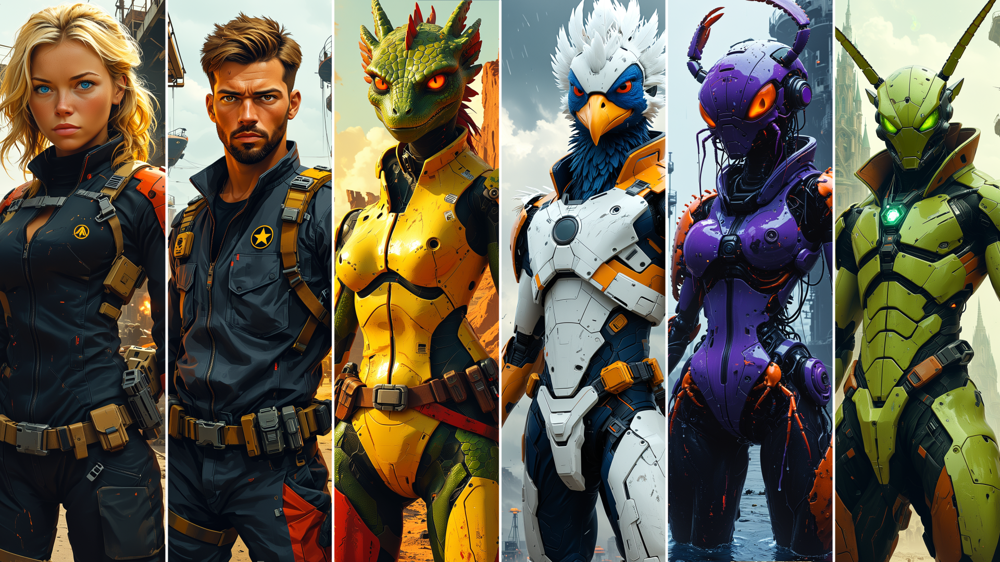
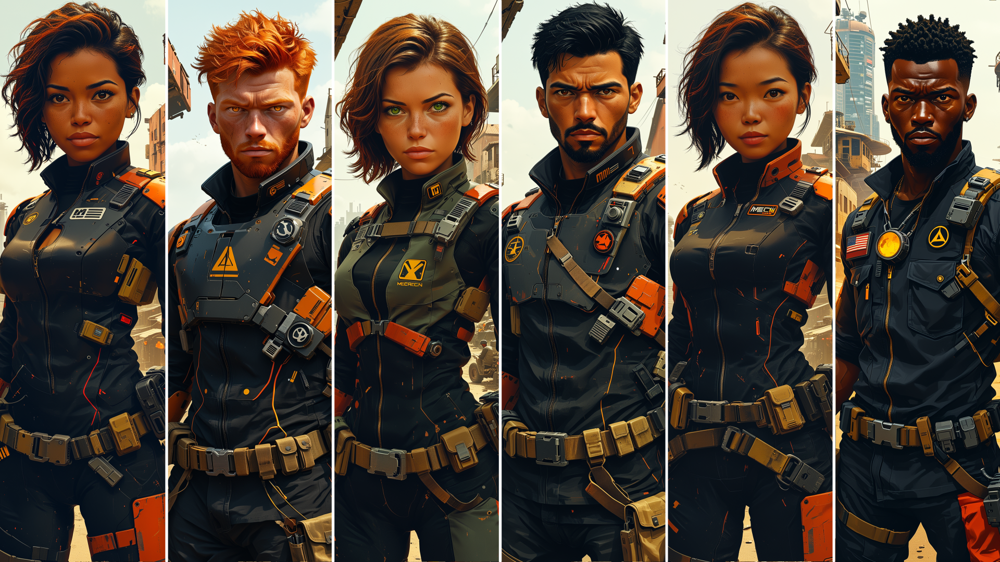
_The first batch is a set of final outputs is a set of pilot body shots for 5 different factions in a sci-fi setting. The full set actually has 4 alien type factions, and 12 humanoid based races, and male and female for each. This output is concept but copyright protected as it will hopefully feature in something larger._

The tricky part amongst all the front loading of new concepts, to me, and building workflows... is getting the components and tools to be consistent. This has been very eye opening for me.

Part of this project is writing custom nodes foe the LiteGraph based node system (Nodejs and python communicating together), to add functionality for the workflows that I need.

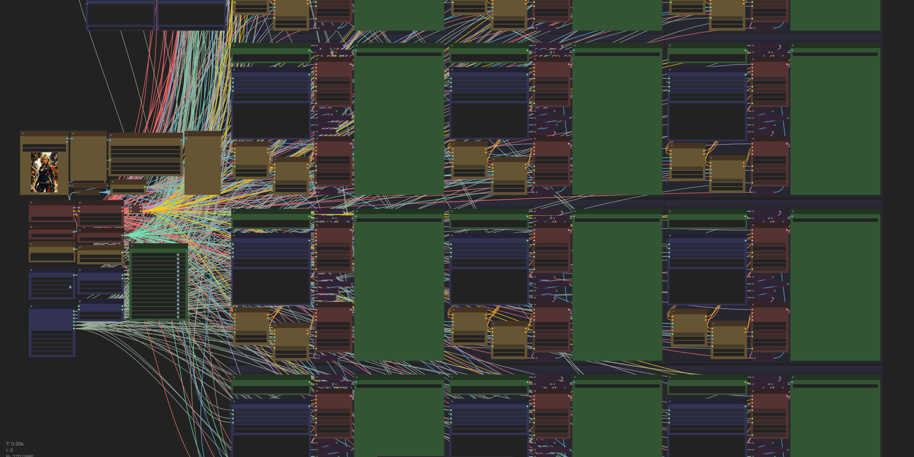
_One of my workflows to generate the concept art shown above._

Something to note: this was over 1 months work, and I think it's not a simple as people might think. I was certainly surprised and impressed with the results.

## 3D graphics rendering

I am working on **OpenGL** and **Vulkan** 3D graphics rendering for real-time applications.

I have explored code implementation in both **Python** and **C++**. The python projects use ModernGL wrapper of OpenGL. I also have work with a C++20 version, for both OpenGL and Vulkan APIs as well as using _CMake_, _GNU Compilers_, _GLFW_, and _GLM_ libraries.

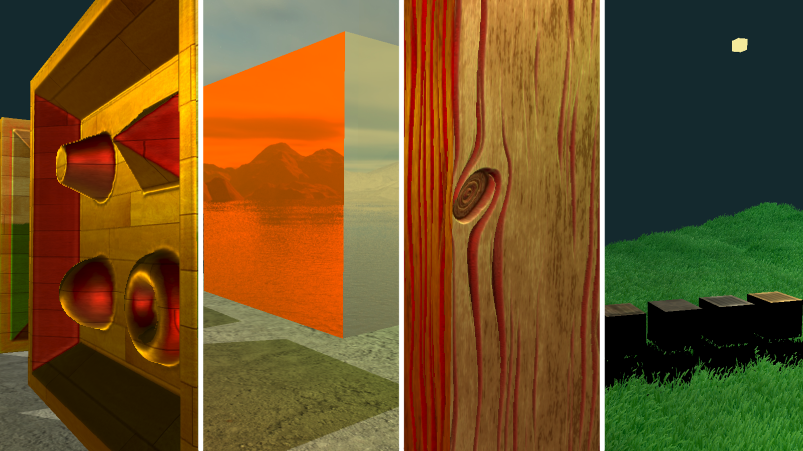
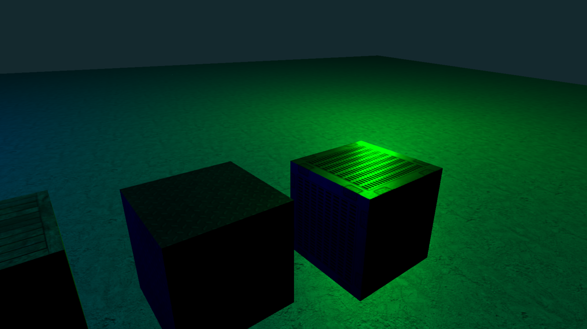
_A few examples of advanced concepts that I've built from scratch: Parallax occlusion mapping, environment mapping, bump mapping, terrain, bill-boarding, shadows, and physical BRDF illumination._

The series is open source and I am documenting the process of building the engine up piece by piece in one of my [GitHub repositories](https://github.com/nokotamustang/OpenGL_and_Vulkan_3D).

This series covers the basics of 3D graphics rendering, including the mathematics behind it, the rendering pipeline, and the implementation of various rendering techniques such as lighting, shadows, and post-processing effects. the goal is to build a complete engine that handles many technical rendering techniques together, including physics simulation and interactive control for games.

## Machine Learning for tracking vehicles

This application uses AI to produce turning counts, in other words a detailed tally of the categories of vehicles during various blocks of time in the day.

The platform that I worked on uses a range of Amazon Web Services, including **S3**, **Lambda**, **API Gateway**, **DynamoDB**, **Batch** and **ECS**, and **SageMaker**.

The First part I worked on uses a variety of Amazon Web Services (AWS) technologies that span across **GPU compute** enabled **EC2** instances; with **Docker** images running via **ECS**; and wrapped inside **AWS Batch** for automated queuing. Everything is designed for scalability.

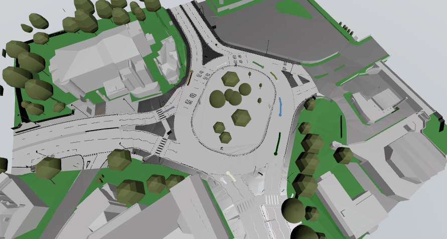
_The 'digital twin' output of the tool recreates the vehicle movement in a 3D space._

I worked on building the scalable solution for this product, using **AWS Cloud Formation** with **Cloud Development Kit** (CDK) to build a scripted architecture for the pipeline.

## SaaS account and billing system

This application uses deep learning algorithms to alter audio files. The platform is built using Python, PyTorch, and runs on AWS.

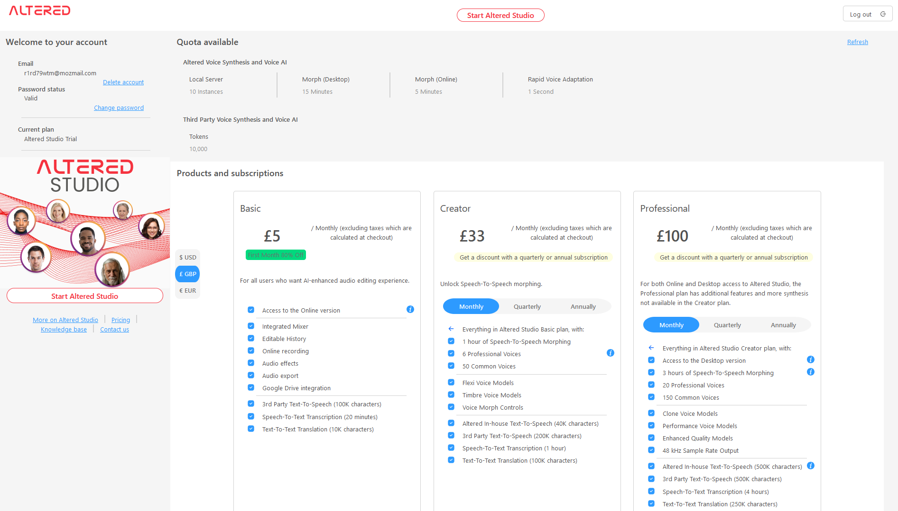
_I designed and built a customer management portal and payment system to help the company scale-up their product service (SaaS). The stack was **React** with **Redux**, within a **Typescript** environment running on **Node.js**._

The payment system is connected to Chargebee, a third-party system that works with **Stripe**, which is in turn connected to third party payment gateways.

On the main app itself I have worked on adding components to the tools, and controls for third party effects wrappers and other tasks such as import/export of raw data from various file formats, and general maintenance and bug fixing. This application is an **Electron** app with a codebase written mostly in **Typescript**.

## Augmented reality for beauty

I built an **Electron** desktop application to integrate simulation toolkit with web technologies for the front-end. This used **TypeScript** web logic with the **C++19** backend of the Augmented reality software.

I led a research project to determine how realistic their foundation makeup simulation algorithm was; and then to design an improved one. For this I predominantly worked in Python for prototyping ideas seen from research papers; and **C++19** for the back-end application in which I created new tools for measuring the accuracy compared to real makeup.

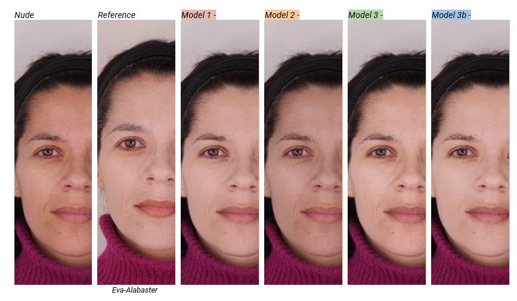
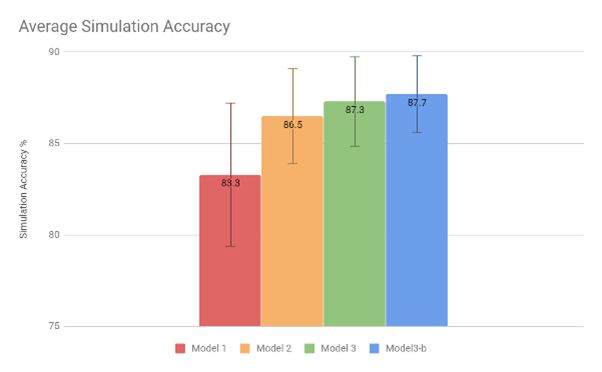
_From foundation makeup testing on real skin, to one simulation of foundation from the renderers, and the simulation accuracy metrics._

I led a research project to create a concept of AR makeup tutorials. This used face tracking in real-time video combined with animations made in **After Effects**. The technologies are the **C++19** backend for the tracker, **Emscripten** to compile the application into **ASM-JS** for web, and **Typescript** for the front end and tools to render the real-time animations. This tool for example is used by Burberry for their Virtual Studio.

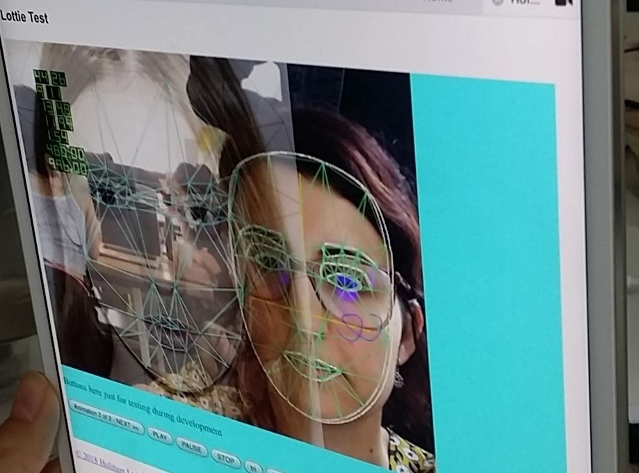
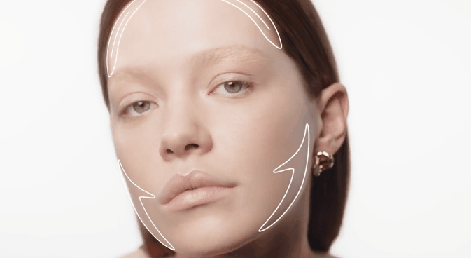
_From first prototype of my work with another Senior Engineer, to the production version as used in Burberry's Virtual Studio._

I created a comparison tool to show the difference between the real makeup (in controlled lighting) to the simulation makeup. This tool was used to help improve the accuracy of the simulation algorithm by providing a quantitative measure of the difference between the two.

## Big data for detecting fraud in finance

I have built a Python **Fast API** server running a **MySQL** database of public tradable USA securities, general market data. The front-end app is built in a **React** / **Node.js** custom built and can display complex charts.

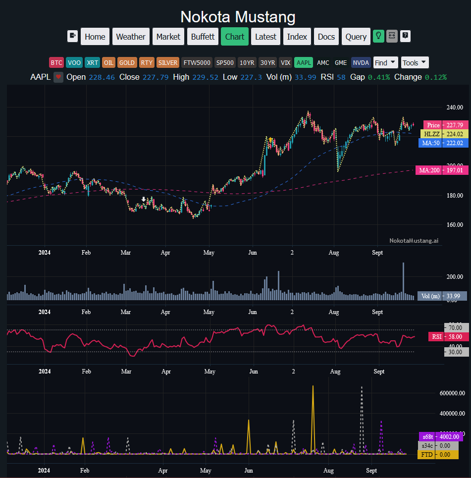
_I track various data sources around the stock tickers, such as the Failures-To-Deliver, and can produce many technical indicators of the trading prices._

I have been tracking bankruptcy restructuring in North American companies. This includes reading and understanding legal document in the Federal Court dockets, and using this information to find patterns in financial fraud.

## Augmented reality for sports broadcast

I worked on the **Piero** project which is software used to generate real time augmented reality video with **Java** and **C++**, using **OpenGL** for 3D graphics creation.

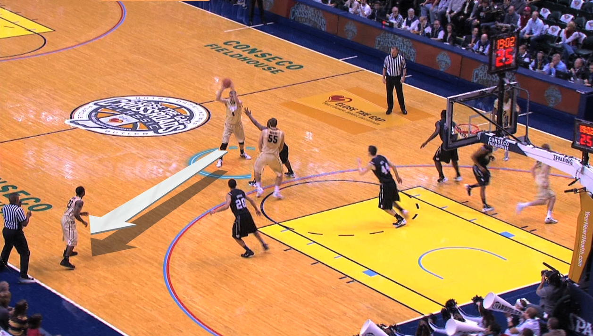
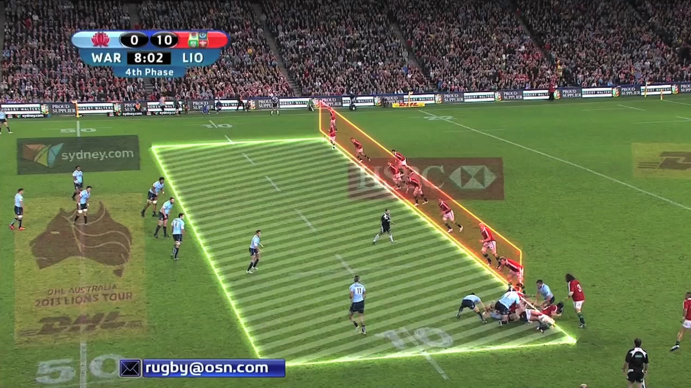
_I had built many effects into the software which can be seen on Sport broadcasts for Tennis, Football, and Rugby._

Part of the challenge was working with 3D graphics and video in real-time, which required a deep understanding of computer graphics and video processing; the real-time rendering has to be ready for the broadcast in less than 4 frames to be broadcast ready.

## PhD thesis in computer vision

I led a Computer Vision project for the measurement of granular organic matter in an on-line environment. The major hurdle was to measure the percentage of broken rice in a stream of rice grains.

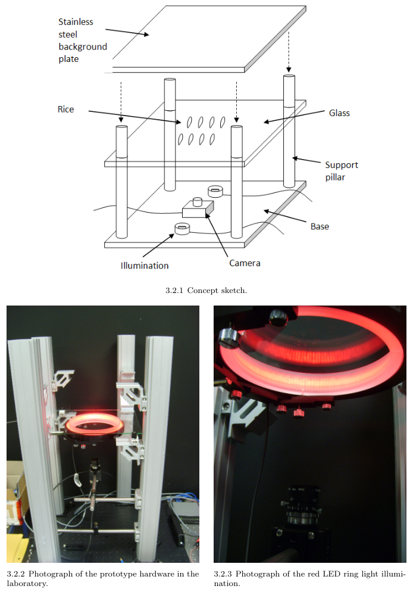
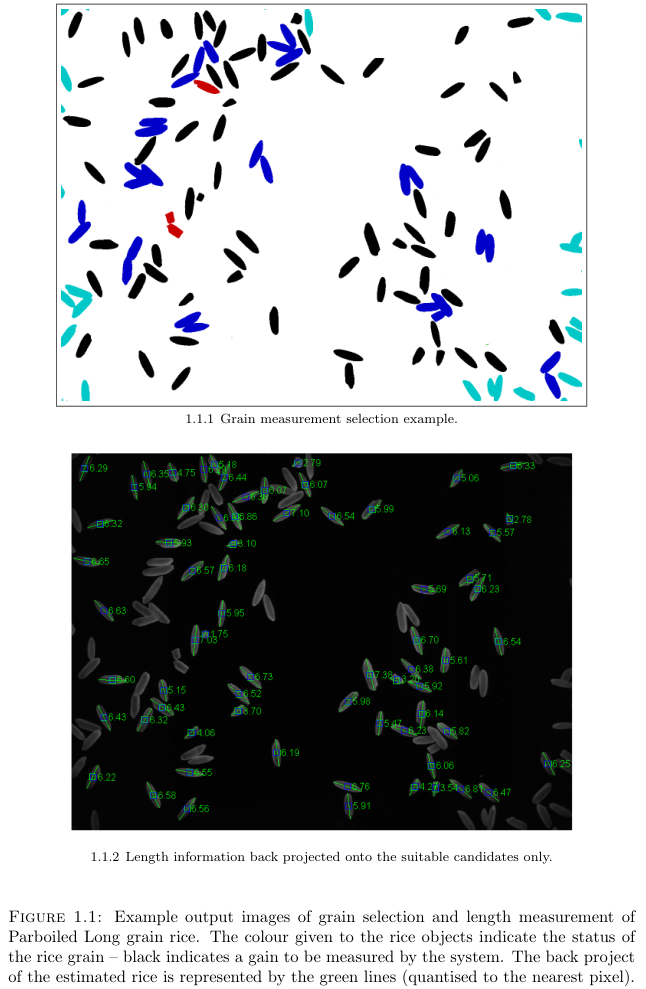
_The first complex problem was the task to measure the length of rice in a static image. Following with the task to measure the length of rice as it freely moves in a stream._

The system had to be able to measure the size of the grains, the color of the grains, and the shape of the grains. The system had to be able to do this in real-time, as the grains were moving down a conveyor belt at a high speed.

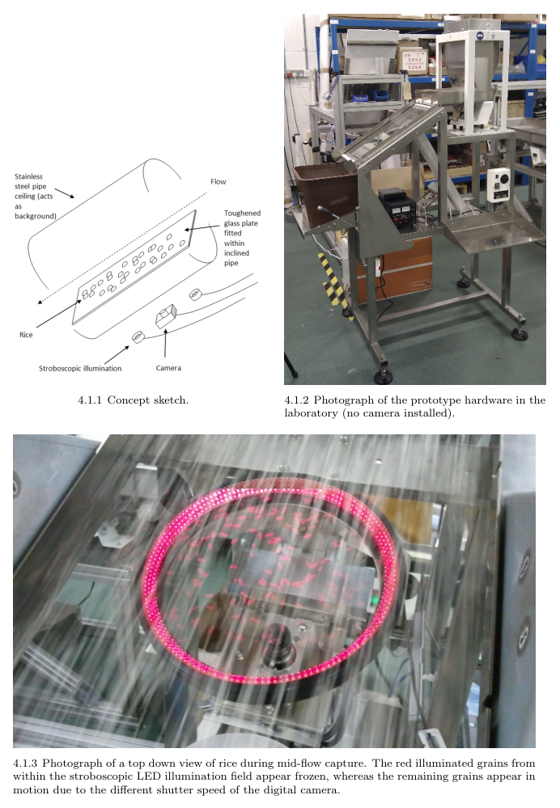
_The system was able to measure the percentage of broken rice from 25,000 grains in a moving stream within 5 minutes. Evaluation of a series of 12 measurements of 25,000 rice grains each experiment._

## Computer vision for object separation of grains

I completed a one-year research project on ‘Separation of Touching Objects’ in an image, and then produced a solution to the problem for organic matter such as touching rice grains.

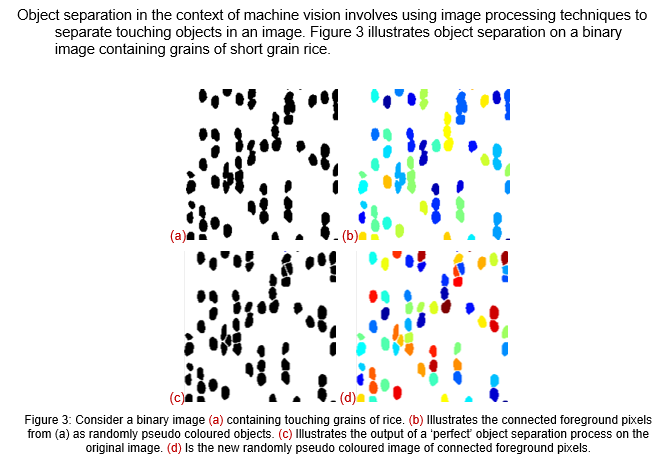
_Separation of touching rice grains._

## Computer vision for food optical sorting

I worked as an image processing engineer to advance the technology of optical sorting machines for food.

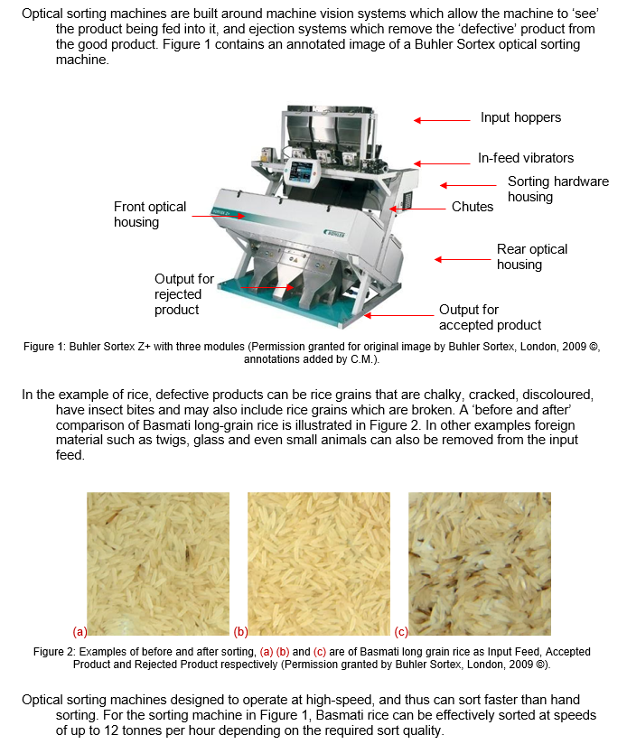
_The Defect Browser was a prototype tool that could simulate the defect detection that the company used in their high performance machines, with a twist. This tool to simulate a variety of parameters and allow the user to manipulate and view the results in real-time._

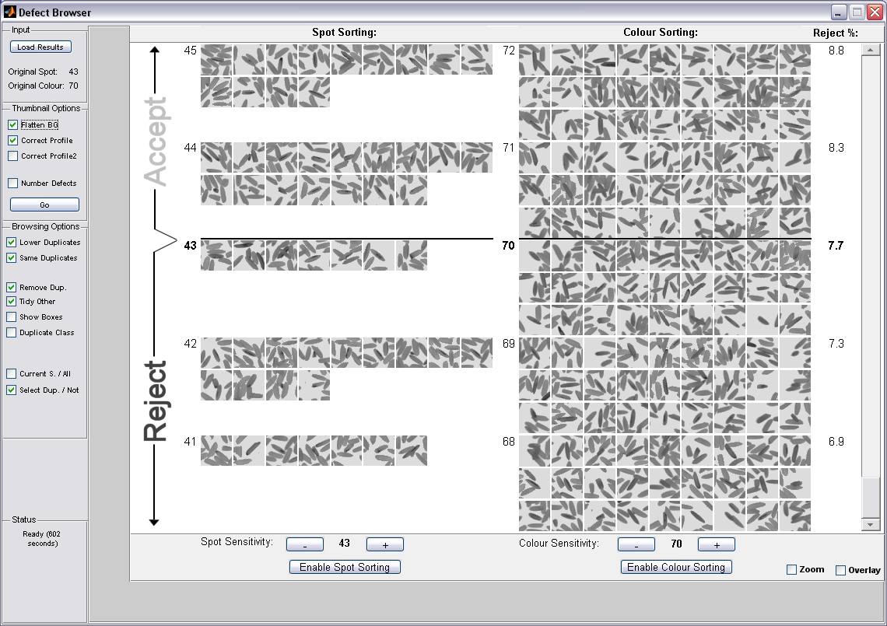
_The horizontal line would represent the defect threshold and the operator could adjust this to see how the machine would react to different levels of defects using real data from the machines._

The Feed Quality Measurement tool was a prototype tool that could measure the quality of the feed of the machine. Better quality of the feed would be the grains spread out across the chute, worse quality would be the grains clumped together which meant the air-ejectors would fire and hit 'innocent bystander' grains when a defect was detected.

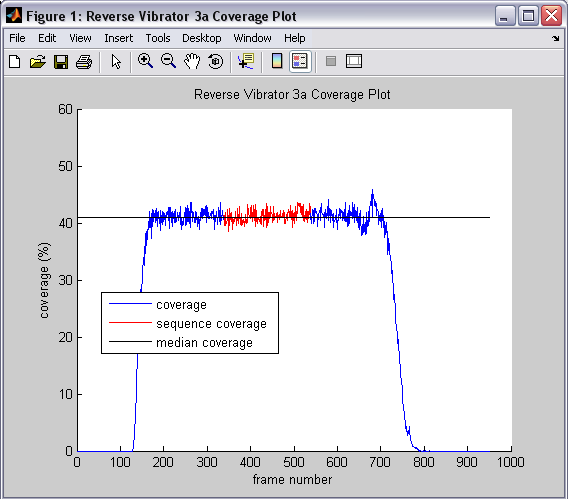
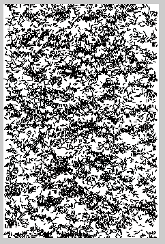
_A variety of measurements were taken to determine the quality of the feed, and the tool would output a score based on these measurements as the 'clumpyness' metric. The following images are example outputs that show the coverage measurement of the frames of rice, an example threshold set of frames, the distribution of grains across the width of the chute, and the final score of the feed quality measurement._

This tool allowed the company's mechanical engineers to build a variety of prototype chute designs to improve the feed quality of the machines. They selected a 'chamfered' design that contains numerous steps down the chute which allows the grains to spread out more evenly across the chute every time they bounce down a step. This increased the productivity of one machine by about 200% in final testing.

## 2D graphics game engine for PC

This PC game was primarily written in **C++** using the **OpenGL** for graphics rendering.

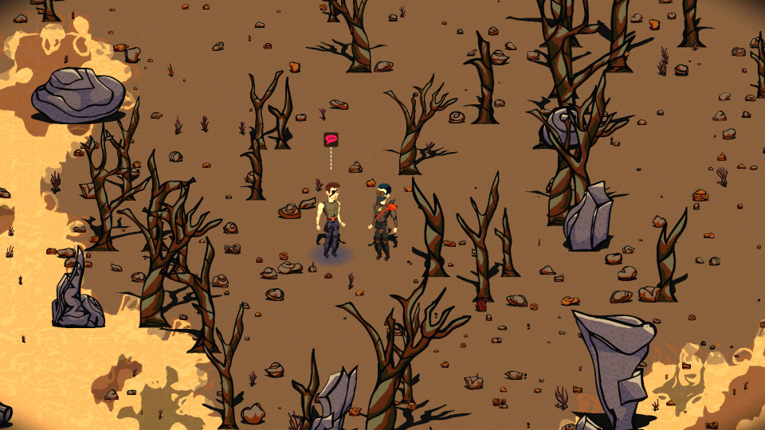
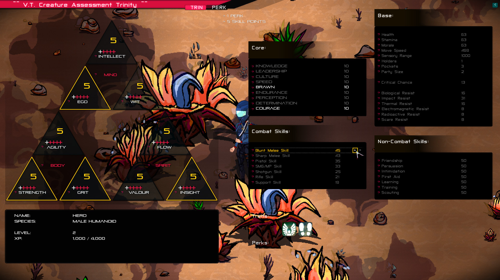
_This project used procedural generation for random levels, and a variety of monsters and bosses to fight against._

## 2D graphics game engine

A 'monster tamer adventure' PC game. The technologies used are **C++**, **OpenGL**, and **GLSL** pixel shaders.

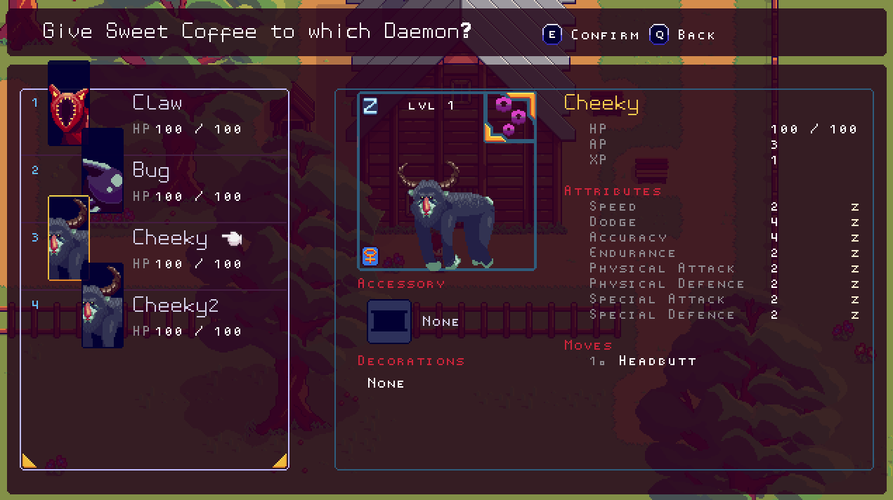
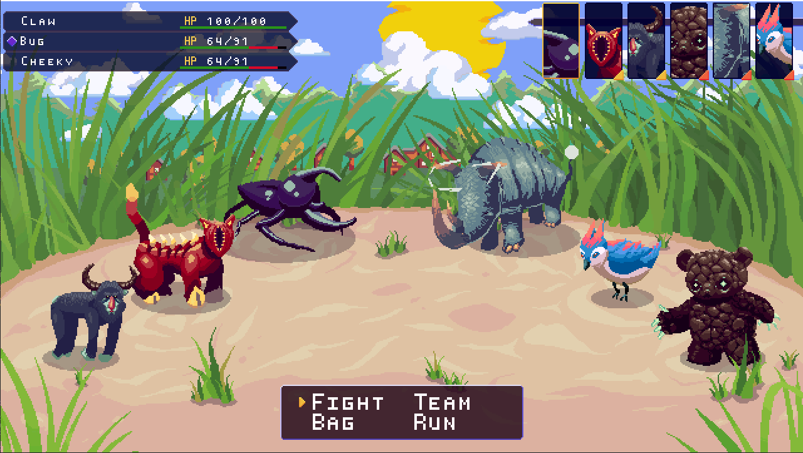
_The final prototype which included a fully working User Interface, map system for the player to travel around, and a battle system with a variety of monsters to fight against._
