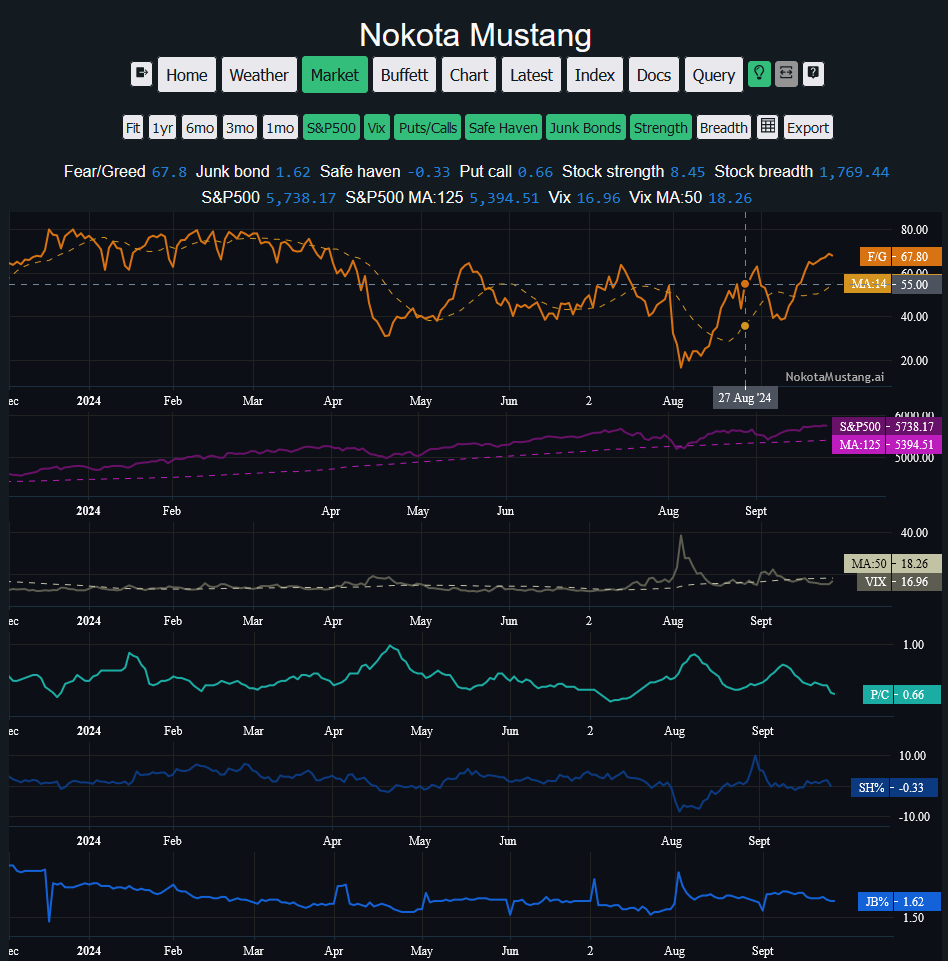
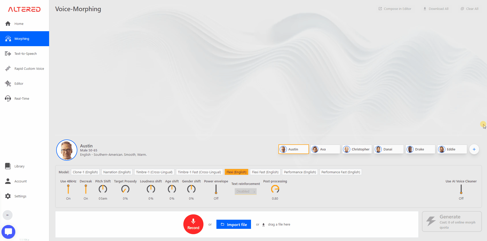
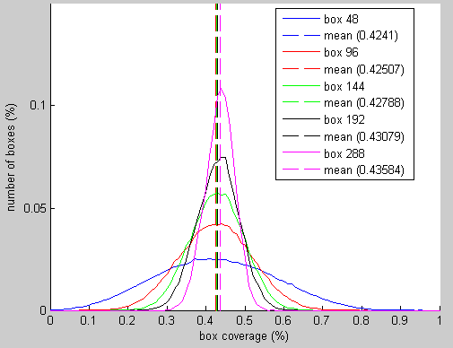

`Celebrating 14 years of Software Engineering and Computer Science`

As a life long student of Software Engineering and Computer Science, I have been learning and practicing the art of software development for the past 14 years. I have been working on various projects, both personal and professional, and have gained a lot of experience in the field. I have worked with different programming languages, frameworks, and tools, and have developed a deep understanding of the software development process.

In this repository, I have compiled some of my best work from the past 14 years. These projects showcase my skills and expertise in software engineering and computer science. I hope you find them interesting and useful.

Here are some of the projects that I have worked on, most recent first.

## Nokota Mustang - Financial Data and Machine Learning - Freelance - 2024 to ongoing

Currently loving building a Python **Fast API** server running a **MySQL** database of the USA stock market data and other market data, with a **React** / **Node.js** front end.

The data includes market data, company data, and public company stock price data.

In addition I have been tracking bankruptcy restructuring in USA public companies. This includes reading and understand legal document in the Federal Court dockets, and using this information to find patterns in financial fraud. This information could be used to predict future bankruptcies and help investors make better decisions, or to detect fraud and open up early avenues to investigate.

As I progress I will be using machine learning algorithms to predict future stock prices and company performance based on historical data. I will also be using natural language processing to analyze legal documents and find patterns in financial fraud. With some time and a little more personal funding I wil host this on AWS and use the AWS CDK to build a scalable infrastructure.

## Route Konnect - Machine Learning Ops Platform in AWS for Vehicle Identification and Tracking - Senior Machine Learning Engineer - 2023 to 2024

Route Konnect aims to solve legacy problems and plan for the future, town planners, traffic surveyors, and local authorities need rich, joined-up information on how road users move through our cities. Conventional analytics rely on manual counting, which is notoriously slow, inaccurate, and one-dimensional. Technological solutions are more advanced but often suffer from one-size-fits-all approaches.
The main output is a report on the turning counts, in other words a detailed tally of the categories of vehicles during various blocks of time in the day, and the direction they are moving in for the specific junction. This is a key metric for traffic planning and road safety.

The 'digital twin' output of the tool recreates the vehicle movement in a 3D space.

Outputs from the Route Konnect platform also include 'desire lines' and 'heat maps', which are used to identify the most popular routes and areas of congestion. These outputs can be used to inform planning decisions, such as where to build new roads or public transport links, or where to implement traffic calming measures. The platform can also be used to monitor the impact of changes to the road network, such as new road layouts or traffic restrictions.

The platform was built in AWS using a range of services, including **S3**, **Lambda**, **API Gateway**, **DynamoDB**, **Batch** and **ECS**, and **SageMaker**. The data is collected from a customer, who uses the online tools to create the project for processing in the system. The data is processed using machine learning algorithms to identify vehicles and track their movements. The platform provides a web-based interface for users to view the data and generate reports.

How I helped:

1. This project for data analysis of videos with cross-camera tracking of vehicles and pedestrians is ambitious and technically complex. The First part I worked on uses a variety of Amazon Web Services (AWS) technologies that span across **GPU compute** enabled **EC2** instances; with **Docker** images running via **ECS**; and wrapped inside **AWS Batch** for automated queuing. Everything is designed for scalability, robustness, and the next step was to implement everything in a scripted **AWS CDK** infrastructure. This was built with **Node.js** with **Typescript** for the web apps and **AWS Lambdas**, and **Python3x** for the heavy processing work.

1. I worked on building the scalable solution for this product, using **AWS Cloud Formation** with **Cloud Development Kit** (CDK) to build a scripted architecture for the pipeline. I have aimed to utilize unit tests, functional tests, and stack tests to help contain and test the code for the CDK implementation during this phase.

1. I was inspecting the existing prototype code for the machine learning algorithm, and planning a strategy for improving the classification results and providing code and scientific robustness.

## Altered AI - Machine Learning for Audio Morphing - Senior Software Engineer - 2022 to 2023

Altered AI is a machine learning platform that uses deep learning algorithms to alter audio files. The platform can be used to change the pitch, tempo, and other characteristics of audio files, allowing users to create new and interesting sounds. The platform is built using Python, PyTorch, and runs on AWS.

The morphing tool in action, which is the main feature of the Altered AI Studio application. Although there are many other features, this is the most popular and widely used tool in the application. I helper to build, for example, the audio tools that modify the mixer and effects.

What I built:

My contributions to the Altered AI project have been in two main areas: the billing system, and then helping with new features in the web application.

1. I designed and built a customer management portal and payment system to help the company scale-up their product service (SaaS). I rapidly built up this project from scratch in **React** with **Redux** for state management, within a **Typescript** environment running on **Node.js**. The payment system is connected to Chargebee, a third-party system that works with **Stripe**, which is in turn connected to third party payment gateways. I have also been interacting with endpoints and **AWS Lambda** code hosted with **Amazon Web Services** working with a great backend engineer to build this complex system that handles an account database with quota management and an automated third-party payment transaction system.

The billing system that I built for Altered AI is a complex system that handles an account database with quota management and an automated third-party payment transaction system. The system is built using **React**, **Redux**, and **Node.js**, and is connected to a third-party payment gateway.

1. On the main app itself I have worked on adding components to the tools, and controls for third party effects wrappers and other tasks such as import/export of raw data from various file formats, and general maintenance and bug fixing. This application is an **Electron** app with a codebase written mostly in **Typescript**, but was ported to a web browser environment.

## Freelance - Pocket Monster Prototype - Game Designer/Developer - 2020 to 2022

I attempted making a ‘monster tamer adventure game’ tech demo. The technologies used are **C++19**, Lua**, **OpenGL**, **GLSL** pixel shaders, and a variety of third-party tools for graphic and map design (**Tiled**, **Photoshop\*\*). The goal is a simple code base that requires no additional workload to publish on vastly different target platforms.

First prototype of the battle system.

Next is the final prototype which included a fully working User Interface, map system for the player to travel around, and a battle system with a variety of monsters to fight against. The game was designed to be a single player experience

## Holition - Augmented Reality - Senior R&D Computer Engineer - 2018 to 2020

Holition is a creative agency that specializes in augmented reality and virtual reality experiences. The company works with luxury brands to create interactive and immersive experiences for their customers. My role at Holition was to work on the development of augmented reality applications for beauty and fashion brands. I worked on a range of projects, from beauty simulation tools to virtual try-on experiences.

My contributions were three large projects in Augmented Reality:

1. The First project was building an **Electron** desktop application to integrate Holition's beauty simulation toolkit with web technologies for the front-end. **Electron** is a Chromium/Node integrated tool that I had helped join the **JavaScript** (**TypeScript**) web logic with the **C++19** backend of the Augmented reality software.
   The Charlotte Tilbury Magic Mirror uses the Holition beauty simulation toolkit to allow customers to try on different makeup looks in real-time. The application uses face tracking and augmented reality to overlay virtual makeup onto the customer's face.

1. Next, I led a research project to determine how realistic their foundation make-up simulation algorithm was; and then to design an improved one. For this I predominantly worked in Python for prototyping ideas seen from research papers; and **C++19** for the back-end application in which I created new tools for measuring the accuracy compared to real make-up.

From foundation makeup testing on models, to one simulation of foundation from the renderers, and the simulation accuracy metrics:

1. Finally, I led a research project to create a concept of AR make-up 'tutorials'. This used face tracking in real-time video combined with animations made in **After Effects**. The technologies are the **C++19** backend for the tracker, **Emscripten** to compile the application into **ASM-JS** for web, and typescript for the front end and tools to project the live 2D animations. This tool for example is used by Burberry for their Virtual Studio.

From first prototype of my work with another Senior Engineer, to the production version as used in Burberry's Virtual Studio:

## Freelance - Dark Wish - Game Designer/Developer - 2016 to 2018

My own self-funded game ‘Dark Wish’ was coded with the OpenGL framework. **LÖVE** released on the PC platform Steam in early 2019. The code is primarily written in Lua and C++ using the **LÖVE** API to access the **OpenGL** graphics library and **Simple Direct-Media Layer** library. This work involves game design, planning and prototyping, development, testing, audio engineering, and digital artwork creation.

For this project I mainly follow a Data Oriented Design methodology in this project typically used for high data flow systems such as game engines. However, I created my User Interface system with an Object-Oriented design. I have also been more involved with low-level graphics programming such as **GLSL** pixel-shader programming for visual effects.

I learned a lot from this experience and hope to fill in the gaps in my knowledge (marketing, business management, strategy) and hopefully overcome these difficulties in my next projects.

## Red Bee Media - AR Sports Graphics for Broadcast TV - Software Engineer - 2013 to 2016

I worked on the **Piero** project which is software used to generate real time augmented reality video with **Java** and **C++**, using **OpenGL** for 3D graphics creation. The clients would use the software to generate the effects to render to live broadcast like how **After Effects** is used.
`

As a software engineer, I had to implement new visual effects into the codebase including design, implementation, and testing; maintain and fix bugs; and make changes to the software on client’s requests. I had created many effects to the software, which can be seen on most Sport broadcasts for Tennis, Football, Rugby, etc.

Part of the challenge was working with 3D graphics and video in real-time, which required a deep understanding of computer graphics and video processing; the real-time rendering has to be ready for the broadcast in less than 4 frames to be broadcast ready.

We expanded the Piero software to work with **Opta** data, allowing even more use cases with large datasets of sports data. This was a big project that required a lot of work to integrate the data into the software and make it usable for the clients.

Another project was integrating the **EA Sports** rendering engine into **Piero**, which allowed for more realistic graphics presentation for the 3D stadium and players models. This was a complex project that required a lot of work to integrate the two systems and make them work together seamlessly.

## Buhler Sortex - PhD Student in Machine Vision - 2009 to 2013

I was commissioned to complete a three-year Machine Vision project for the measurement of granular organic matter in an on-line environment. I have published two research grade papers on this work. The project was originally a prototype that I had written in **MATLAB**, but since the code surpassed all expectations, it was used as the production code in live trials.

The major hurdle was to measure the percentage of broken rice in a stream of rice grains. The system had to be able to measure the size of the grains, the color of the grains, and the shape of the grains. The system had to be able to do this in real-time, as the grains were moving down a conveyor belt at a high speed.

So first was the task to measure the length of rice in a static image.

Following with the task to measure the length of rice as it freely moves in a stream.

The system was able to measure the percentage of broken rice from 25,000 grains in a moving stream within 5 minutes. Evaluation of a series of 12 measurements of 25,000 rice grains each experiment, repeated with two varieties of rice. Observations were made of a mean error of broken rice estimation without correction factor applied is 0.12%, and with correction factor applied is -0.57%.

## Buhler Sortex - Computer Vision for Object Separation of Grains - Contract research Engineer - 2008 to 2009

I completed a one-year research project on ‘Separation of Touching Objects’ in an image, and then produced a solution to the problem for organic matter such as touching rice grains.

The work contract required deliverables at the end of the year, which included a technical report and all the software code which I had programmed in MATLAB.

I was able to submit this project for my final project at the university, in which I was awarded full marks and won an award for the ‘Digital Imaging Research Centre Prize' for that year.

## Buhler Sortex - Computer Vision for Food Optical Sorting - Placement Image Processing Engineer - 2007 to 2008

I worked in the research & development department, as an image processing engineer to advance the technology of some of the machines that Buhler Sortex design, build, and sell. My role involved writing software prototypes and technical reports on the feasibility of new image processing solutions. I am co-inventor of a series of EU, US, and World patents.

Roughly, 75% of the role was algorithm design and code implementation and testing within the MATLAB programming language. My main tasks were to help develop rapid prototypes to prove/disprove research concepts and help to analyze their effectiveness to improve the technologies of Sortex's current optical sorting machines. Some examples of the projects I worked on are:

1. The Defect Browser was a prototype tool that could simulate the defect detection that the company used in their high performance machines, with a twist. This tool to simulate a variety of parameters and allow the user to manipulate and view the results in real-time.

The horizontal line would represent the defect threshold and the operator could adjust this to see how the machine would react to different levels of defects using real data from the machines.

1. The Feed Quality Measurement tool was a prototype tool that could measure the quality of the feed of the machine. Better quality of the feed would be the grains spread out across the chute, worse quality would be the grains clumped together which meant the air-ejectors would fire and hit 'innocent bystander' grains when a defect was detected.

A variety of measurements were taken to determine the quality of the feed, and the tool would output a score based on these measurements as the 'clumpyness' metric. The following images are example outputs that show the coverage measurement of the frames of rice, an example threshold set of frames, the distribution of grains across the width of the chute, and the final score of the feed quality measurement.

This tool allowed the company's mechanical engineers to build a variety of prototype chute designs to improve the feed quality of the machines. They selected a 'chamfered' design that contains numerous steps down the chute which allows the grains to spread out more evenly across the chute every time they bounce down a step. This increased the productivity of one machine by about 200% in final testing.
