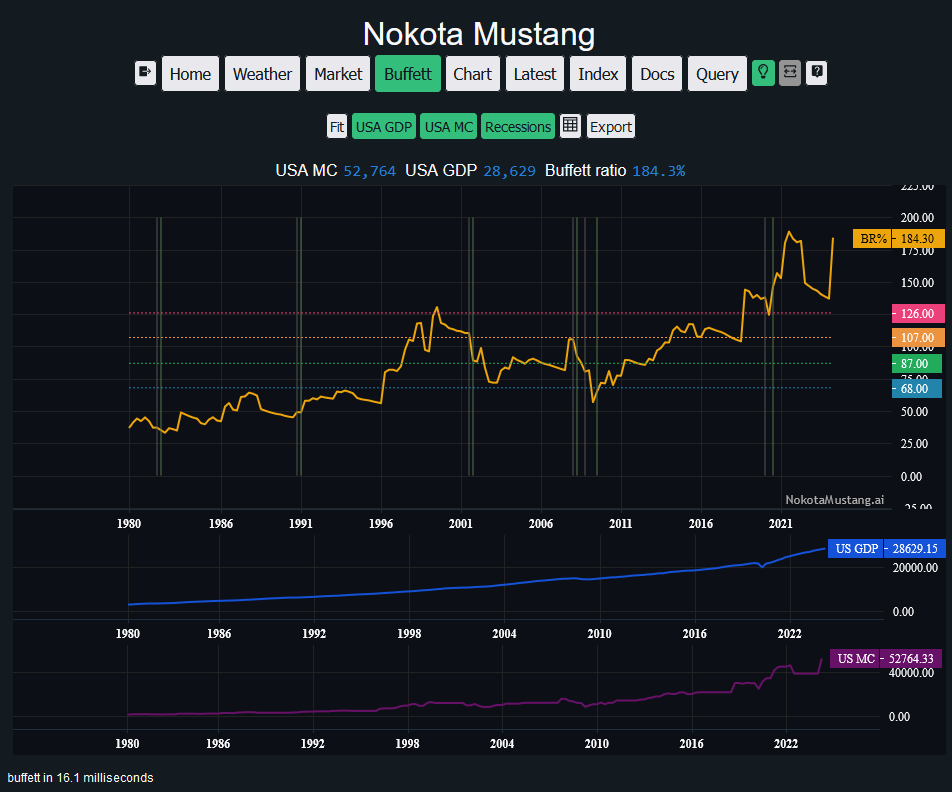
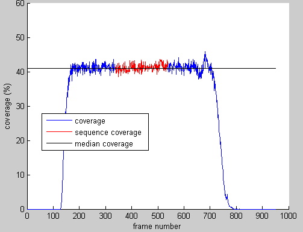

`Celebrating 14 years of Software Engineering and Computer Vision`

I have worked on various projects, both personal and professional, and have gained a lot of experience in the field.

These projects showcase my skills and expertise in software engineering and computer science.

## Financial Data and Machine Learning - 2024 to ongoing

I'm building a Python **Fast API** server running a **MySQL** database of the USA stock market data and other market data, with a **React** / **Node.js** front end.

I have been tracking bankruptcy restructuring in North American companies. This includes reading and understanding legal document in the Federal Court dockets, and using this information to find patterns in financial fraud.

## Machine Learning Ops Platform in AWS for Vehicle Identification and Tracking - 2023 to 2024

This application uses AI to produce turning counts, in other words a detailed tally of the categories of vehicles during various blocks of time in the day.

The platform that I worked on uses a range of Amazon Web Services, including **S3**, **Lambda**, **API Gateway**, **DynamoDB**, **Batch** and **ECS**, and **SageMaker**.

The First part I worked on uses a variety of Amazon Web Services (AWS) technologies that span across **GPU compute** enabled **EC2** instances; with **Docker** images running via **ECS**; and wrapped inside **AWS Batch** for automated queuing. Everything is designed for scalability.

The 'digital twin' output of the tool recreates the vehicle movement in a 3D space.

I worked on building the scalable solution for this product, using **AWS Cloud Formation** with **Cloud Development Kit** (CDK) to build a scripted architecture for the pipeline.

## Account and Billing System + Application For Audio Morphing - 2022 to 2023

This application uses deep learning algorithms to alter audio files. The platform is built using Python, PyTorch, and runs on AWS.

On the main app itself I have worked on adding components to the tools, and controls for third party effects wrappers and other tasks such as import/export of raw data from various file formats, and general maintenance and bug fixing. This application is an **Electron** app with a codebase written mostly in **Typescript**.

I designed and built a customer management portal and payment system to help the company scale-up their product service (SaaS). The stack was **React** with **Redux**, within a **Typescript** environment running on **Node.js**. The payment system is connected to Chargebee, a third-party system that works with **Stripe**, which is in turn connected to third party payment gateways.

I built endpoints and **AWS Lambda** code hosted with **Amazon Web Services** while working with the back end engineers.

## 2D Graphics Game Engine - 2020 to 2022

A 'monster tamer adventure' PC game. The technologies used are **C++19**, **OpenGL**, and **GLSL** pixel shaders.

The final prototype which included a fully working User Interface, map system for the player to travel around, and a battle system with a variety of monsters to fight against.

## Augmented Reality for Beauty - 2018 to 2020

These projects are Computer Vision and Augmented Reality applications for beauty and fashion.

I built an **Electron** desktop application to integrate simulation toolkit with web technologies for the front-end. This used **TypeScript** web logic with the **C++19** backend of the Augmented reality software.

The Charlotte Tilbury Magic Mirror uses the toolkit to allow customers to try on different makeup looks in real-time. The application uses face tracking and augmented reality to overlay virtual makeup onto the customer's face.

I led a research project to determine how realistic their foundation makeup simulation algorithm was; and then to design an improved one. For this I predominantly worked in Python for prototyping ideas seen from research papers; and **C++19** for the back-end application in which I created new tools for measuring the accuracy compared to real makeup.

From foundation makeup testing on real skin, to one simulation of foundation from the renderers, and the simulation accuracy metrics:

I led a research project to create a concept of AR makeup tutorials. This used face tracking in real-time video combined with animations made in **After Effects**. The technologies are the **C++19** backend for the tracker, **Emscripten** to compile the application into **ASM-JS** for web, and **Typescript** for the front end and tools to render the real-time animations. This tool for example is used by Burberry for their Virtual Studio.

From first prototype of my work with another Senior Engineer, to the production version as used in Burberry's Virtual Studio:

I created a comparison tool to show the difference between the real makeup (in controlled lighting) to the simulation makeup. This tool was used to help improve the accuracy of the simulation algorithm by providing a quantitative measure of the difference between the two.

## 2D Graphics Game and Engine - 2016 to 2018

This PC game was primarily written in **C++** using the **OpenGL** for graphics rendering.

This project used procedural generation for random levels, and a variety of monsters and bosses to fight against.

## AR Sports Graphics for Broadcast TV - 2013 to 2016

I worked on the **Piero** project which is software used to generate real time augmented reality video with **Java** and **C++**, using **OpenGL** for 3D graphics creation.

I had built many effects into the software, which can be seen on most Sport broadcasts for Tennis, Football, Rugby, etc.

Part of the challenge was working with 3D graphics and video in real-time, which required a deep understanding of computer graphics and video processing; the real-time rendering has to be ready for the broadcast in less than 4 frames to be broadcast ready.

We expanded the Piero software to work with **Opta** data, allowing even more use cases with large datasets of sports data. This was a big project that required a lot of work to integrate the data into the software and make it usable for the clients.

Another project was integrating the **EA Sports** rendering engine into **Piero**, which allowed for more realistic graphics presentation for the 3D stadium and players models. This was a complex project that required a lot of work to integrate the two systems and make them work together seamlessly.

## PhD Student in Computer Vision - 2009 to 2013

I led a Computer Vision project for the measurement of granular organic matter in an on-line environment. The major hurdle was to measure the percentage of broken rice in a stream of rice grains. The system had to be able to measure the size of the grains, the color of the grains, and the shape of the grains. The system had to be able to do this in real-time, as the grains were moving down a conveyor belt at a high speed.

So first was the task to measure the length of rice in a static image.

Following with the task to measure the length of rice as it freely moves in a stream.

The system was able to measure the percentage of broken rice from 25,000 grains in a moving stream within 5 minutes. Evaluation of a series of 12 measurements of 25,000 rice grains each experiment, repeated with two varieties of rice. Observations were made of a mean error of broken rice estimation without correction factor applied is 0.12%, and with correction factor applied is -0.57%.

## Computer Vision for Object Separation of Grains - 2008 to 2009

I completed a one-year research project on ‘Separation of Touching Objects’ in an image, and then produced a solution to the problem for organic matter such as touching rice grains.

## Computer Vision for Food Optical Sorting - 2007 to 2008

I worked as an image processing engineer to advance the technology of optical sorting machines for food.

The Defect Browser was a prototype tool that could simulate the defect detection that the company used in their high performance machines, with a twist. This tool to simulate a variety of parameters and allow the user to manipulate and view the results in real-time.

The horizontal line would represent the defect threshold and the operator could adjust this to see how the machine would react to different levels of defects using real data from the machines.

The Feed Quality Measurement tool was a prototype tool that could measure the quality of the feed of the machine. Better quality of the feed would be the grains spread out across the chute, worse quality would be the grains clumped together which meant the air-ejectors would fire and hit 'innocent bystander' grains when a defect was detected.

A variety of measurements were taken to determine the quality of the feed, and the tool would output a score based on these measurements as the 'clumpyness' metric. The following images are example outputs that show the coverage measurement of the frames of rice, an example threshold set of frames, the distribution of grains across the width of the chute, and the final score of the feed quality measurement.

This tool allowed the company's mechanical engineers to build a variety of prototype chute designs to improve the feed quality of the machines. They selected a 'chamfered' design that contains numerous steps down the chute which allows the grains to spread out more evenly across the chute every time they bounce down a step. This increased the productivity of one machine by about 200% in final testing.
